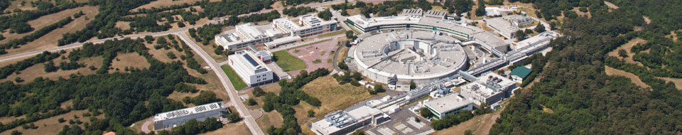
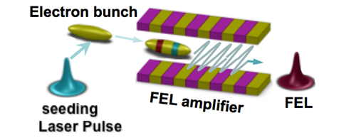

# Welcome to Elettra Sincrotrone Trieste Fecilities 

 
 
 
Elettra Sincrotrone Trieste is a multidisciplinary research centre located at Italy; the centre has a high quality synchrotron (Elettra) and free-electron laser light (FERMI), these facilities are open to international researcher and it be can be used for studying materials in physics, chemistry and life sciences. 

## Facility-1: Elettra

Elettra has energy -2 and 2.4 GeV, photons in the energy range from a few to several tens of KeV with spectral brightness of up to 1019 photons/s/mm2/mrad2/0.1%bw. It is a 3rd generation Italian synchrotron radiation facility has been serving the national, international and industrial communities since 1993 with continuous upgrades up to date. It consists of a storage ring where electron travelling at nearly sped of light through undulators, wigglers and bending magnets to produce synchrotron radiation which is ten billion times brighter than conventional radiation sources with tunable wavelength range from IR to hard Xrays. This beamlines can be used to investigate based on spectroscopy, diffraction, absorption, scattering and imaging. Research is carried out in fields ranging from physics to chemistry, from biology to life and environmental sciences, from medicine to cultural heritage. 
 

Figure 1: Beamline Techniques

Currently, 28 beamlines, including a storage-ring free-electron laser, utilize the radiation generated by the Elettra source. Mostly x-ray based techniques in the areas of spectroscopy, spectromicroscopy, diffraction, scattering and lithography are present shown in Figure(1), together with facilities for infrared microscopy and spectroscopy, ultraviolet inelastic scattering, and band mapping. Versatile experimental stations are maintained at the state-of-the art, offering unique means to carry out outstanding research in diverse fields and disciplines.

## Facility-2: FERMI

FERMI (acronym for Free Electron laser Radiation for Multidisciplinary Investigations) is the seeded free electron laser (FEL) facility shown in Figure.2.  Currently operating in the ultraviolet and soft x-ray range worldwide, FERMI has been developed to provide fully coherent ultrashort (10-100 femtosecond) pulses with peak brightness ten billion times higher than that made available by third-generation light sources. FERMI opens unique opportunities for exploring the structure and transient states of condensed matter, soft matter and low-density matter using a variety of diffraction, scattering and spectroscopy techniques.

 
Figure 2:  Free Electron Laser

FERMI is a single-pass FEL user-facility with wavelength range from 100 nm to 4 nm. The intense and fully coherent radiation pulses in the ultraviolet and soft x-ray range made available by FERMI, combined with the variable polarization and the different temporal correlation modes, open completely new and unexplored frontiers of research. The full potential of time-resolved experiments based on coherent diffraction imaging, elastic and inelastic scattering, photon and electron spectroscopy and transient grating spectroscopy will allow investigations of transient states and nonlinear materials response at the mesoscopic and nanometric scale and give access to dynamic phenomena, including ultrafast magnetization, excitation lifetimes, phase separation and nucleation, complex rearrangements of constituents in cells, and multi‐photon single and multiple ionization.

  
Figure 3: FEL-1: A single-stage high-gain harmonic generation FEL

  
Figure 4: FEL-2: A double-stage high-gain harmonic generation FEL

The FEL output is tunable in wavelength, power, temporal duration and polarization. The user stations can receive light from two FEL lines: FEL-1 shown in Figure.3, which covers the wavelength range 100-20 nm, and FEL-2 shown in Figure.4, which covers the range 20-4 nm. 
For application guidelines and other details: <a href="https://www.elettra.eu/index.html"> Website</a>
Applications for beamline must be submitted electronically through the User Portal of ELETTRA (<a href="https://www.elettra.eu/userarea/apbt.html"> User Area </a>). Each application is assigned to a specific scientific area and is submitted to a Review Committee. Members of these committees are specialists in relevant areas of science
*	A proposal is mainly evaluated based on its scientific merit and technical feasibility of the research plan. You should clearly express what you plan to carry out during the valid term of the proposal.
*	The application will be reviewed based on the description on the form. Please include a full description of the experiment.
*	Only one successful proposal per PI group in a proposal call will be supported for the experiment.        
For Indian User, the travelling allowance, VISA fee and Health insurance etc will be reimbursed on the basis of accepted proposal.
To apply for the grant, please fill the form Travelling Allowance Reimbursement Form.docx and submit along with the required documents in the following the email address manjunathp@iisc.ac.in

